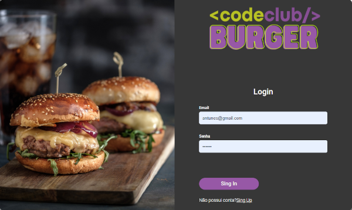
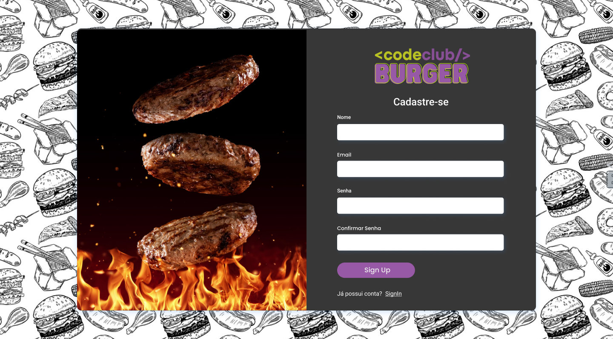
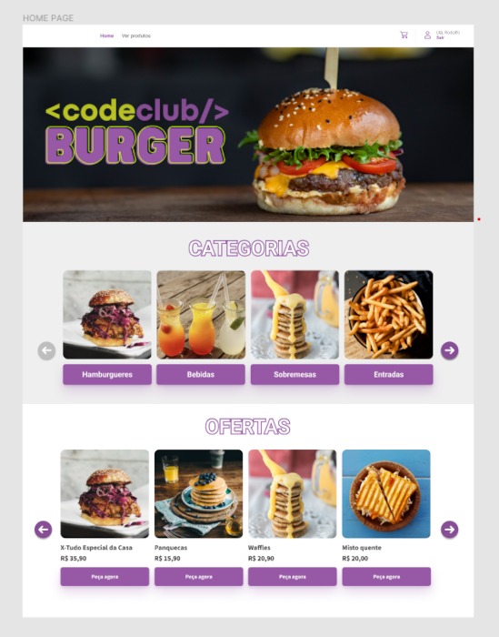
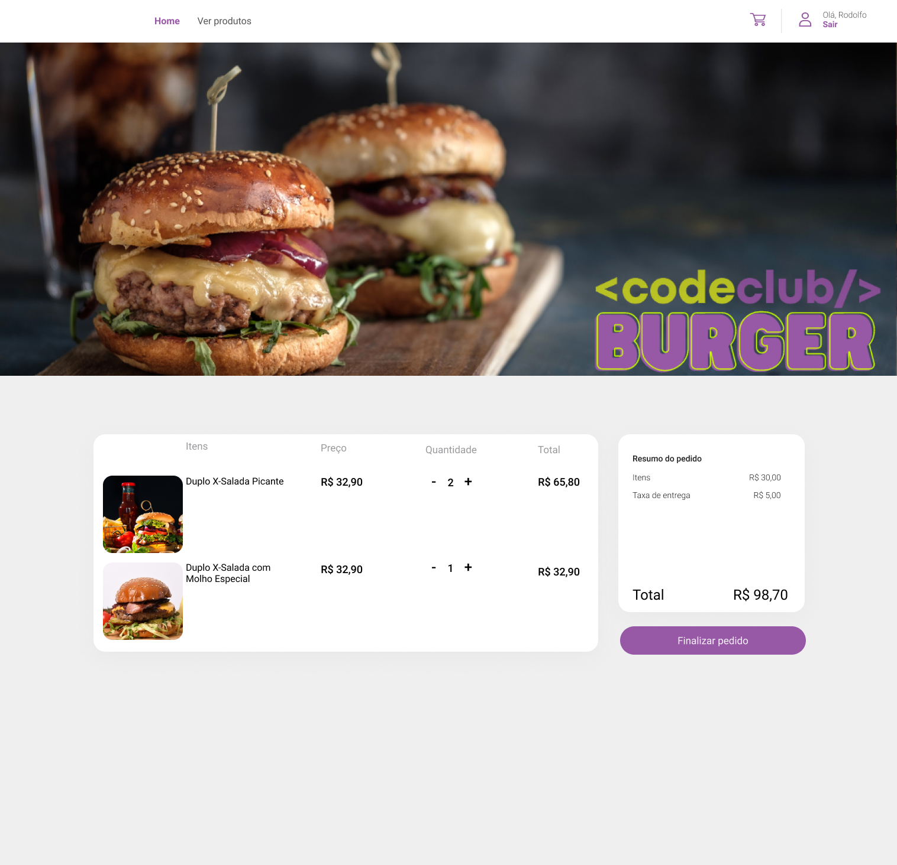
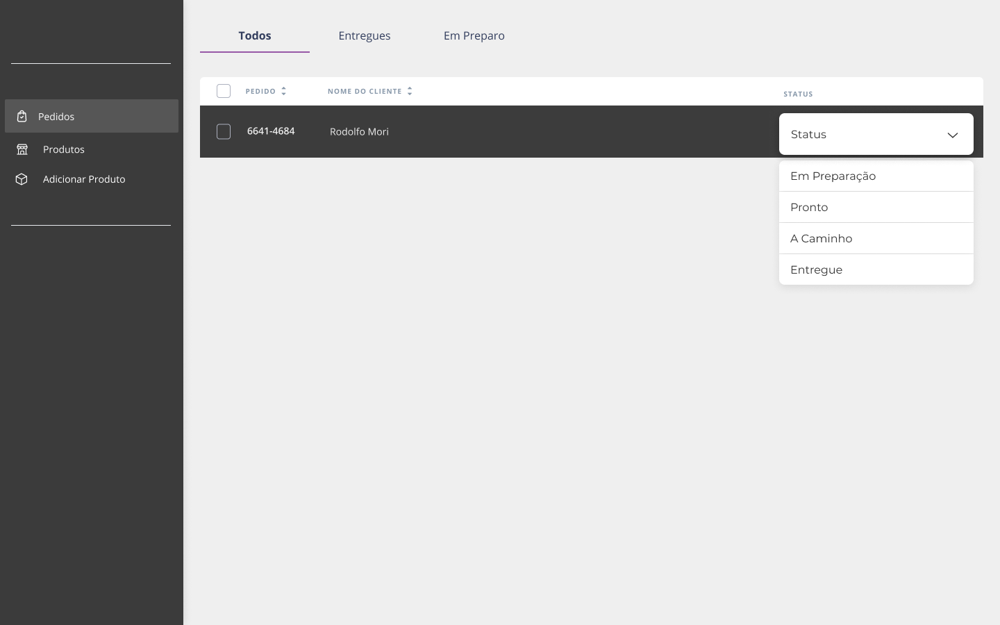
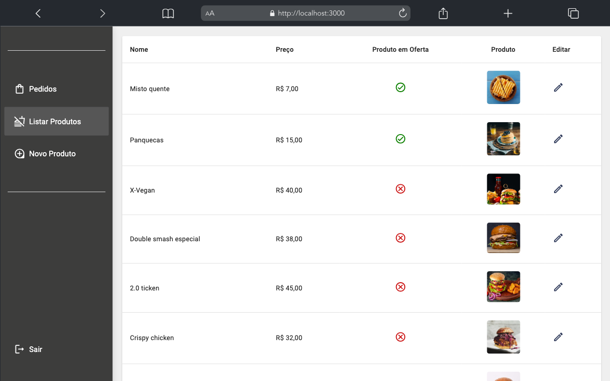

# Projeto CodeBurger

### 	:point_right:Sobre

Projeto de uma hamburgueria voltada para gestão delivery, utilizando tecnologias modernas como React para proporcionar uma experiência de usuário excepcional. O objetivo é criar uma plataforma de pedidos online que seja intuitiva, eficiente e visualmente atraente, permitindo aos clientes personalizar seus pedidos de forma prática e rápida, com uma combinação de tecnologia avançada, design inteligente e foco na experiência do usuário.

### 	:point_right:Funcionalidades do Projeto

 ##### Tela de Login e Cadastro de usuário

***

##### Home
- **Design Atrativo:** Interface moderna e amigável com imagens dos produtos, Visualização por categorias e ofertas
- **Menu Dinâmico:** Lista completa dos hambúrgueres, acompanhamentos e bebidas, com descrições.
- **Ofertas e Promoções:** Seção destacada para promoções atuais e combos especiais

##### Carrinho 
- **Gerenciamento Simples:** Adicionar, remover e modificar itens no carrinho de forma fácil.
- **Cálculo Automático:** Atualização automática do subtotal, taxas de entrega e valor total.

##### Painel do Admin
- **Gestão de Produtos:** Ferramentas para adicionar ou editar itens do menu.
- **Controle de Pedidos:** Visualização e gerenciamento de pedidos recebidos, em andamento e finalizados.

***

### :point_right:Tecnologias / Funcionalidades - Breve Descrição

- **Frontend:**
    - **React:** Biblioteca JavaScript para criação da interface de usuário.
    - **Styled-components:** Estilização de componentes de forma modular.
    - **Axios:** Requisições HTTP para integração com o backend.
    - **React Hook Form:** Biblioteca para gerenciamento de formulários em aplicações React.
    - **Yup:** Biblioteca de validação e transformação de schemas de objetos JavaScript.
    - **React Toastify:** Biblioteca para exibir notificações no estilo toast em aplicações React. 
    - **React Elastic Carousel:** Biblioteca para criação de carrosséis responsivos e flexíveis.
    - **MUI (Material-UI):** biblioteca de componentes de interface 
    - **React Select:** Biblioteca para criar menus dropdown e caixas de seleção.

- **Backend:**
    - **Node.js:** Ambiente de execução JavaScript para construção do servidor.
    - **Yarn**: Gerenciador de pacotes.
    - **Express**: Framework para criação de APIs.    
    - **Padrão MVC**: Estrutura de organização do código.
    - **Docker**: Plataforma para criação de contêineres.
    - **Sequelize**: ORM para manipulação de bancos de dados SQL.
    - **Yup**: Validação de esquemas de objetos.
    - **Multer**: Upload e gerenciamento de imagens com Multer.
    - **UUID**: Geração de identificadores únicos.
   - **MongoDB** / **PostgreSQL** : Utilização dos dois bancos de dados para diferentes necessidades.
    - **Mongoose**: Modelagem de dados para MongoDB.
    - **CORS**:  middleware que permite controlar quais recursos podem ser acessados de diferentes domínios, sendo importante para aplicações web que interagem com APIs.

- **Autenticação e Segurança:**
    - **JWT (JSON Web Tokens):** Autenticação segura dos usuários.
    - **BCrypt:** Hashing de senhas para proteção de dados sensíveis.
   
- **Implantação:**

    - **Railway:** servidor Backend.
    - **Vercel:** Plataformas de hospedagem para o frontend.
    [Visite a página da Hamburgueria]("https://codeburger-interface-chi.vercel.app "Clique aqui para visitar o site ")

    

